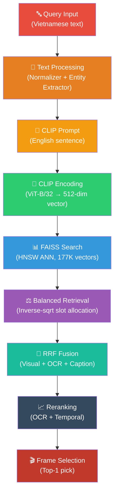

# 🔍 Phân Tích Toàn Diện: Tại Sao Hệ Thống Truy Xuất Sai Video

## Tổng Quan

Sau khi phân tích toàn bộ codebase (15+ files core), tôi đã xác định **7 lớp nguyên nhân** gây ra việc truy xuất hoàn toàn sai video, được sắp xếp theo flow dữ liệu từ query input đến output cuối cùng.



---

## Lớp 1: 🔴 Query Text Processing — Vietnamese→English Translation Loss

### Vấn đề 1.1: CLIP Prompt Builder tạo câu tiếng Anh nghèo ngữ nghĩa

> [!CAUTION]
> **Đây là nguyên nhân GỐC RỄ lớn nhất.** CLIP model chỉ hiểu tiếng Anh, nhưng hệ thống dịch Vietnamese→English bằng rule-based dictionary, KHÔNG dùng neural translation.

**Evidence** — [query_parser.py:405-489](file:///d:/AIC_System/src/reasoning/query_parser.py#L405-L489):

```python
def _build_clip_prompt(self, entities, raw_text, lang_mix):
    # Template cứng: "A photo of [subject] [action] in [setting]..."
    parts = []
    if entities.persons:
        subject = f"a {gender + ' ' if gender else ''}{role}"
    elif entities.objects:
        subject = f"a {entities.objects[0]}"
    else:
        subject = "a scene"   # ← Khi không nhận ra gì → "A photo of a scene" 
    parts.append(f"A photo of {subject}")
```

**Ví dụ cụ thể:**

| Query gốc (Vietnamese) | CLIP Prompt thực tế | Vấn đề |
|---|---|---|
| "Tìm cảnh cháy rừng lớn vào ban đêm, lửa lan dọc sườn đồi" | "A photo of a scene. Tìm cảnh cháy rừng lớn..." | Entity extractor KHÔNG extract được "cháy rừng" → fallback "a scene" |
| "Tìm cận cảnh một thau tròn chứa rất nhiều cá nhỏ màu bạc" | "A photo of a scene, silver. ..." | Chỉ extract được color "bạc"→"silver", mất toàn bộ ngữ nghĩa |
| "Phụ nữ mặc áo xanh họa tiết được phỏng vấn" | "A photo of a female, blue shirt/top" | Khá hơn nhưng mất "phỏng vấn", "họa tiết", "gói sản phẩm" |

**Root cause:**
- [entity_extractor.py](file:///d:/AIC_System/src/preprocessing/entity_extractor.py) chỉ có **~50 objects**, **~15 actions**, **~12 scenes** hardcoded
- Không có khả năng extract ngữ nghĩa mở (open-vocabulary)
- Khi query chứa concept ngoài dictionary → output = "A photo of a scene" → vô nghĩa cho CLIP

### Vấn đề 1.2: Append raw Vietnamese text vào CLIP prompt

```python
# query_parser.py:484-486
if lang_mix.get("vi", 0) > 0.3:
    raw_truncated = raw_text[:80]
    sentence = f"{sentence}. {raw_truncated}"  # ← CLIP KHÔNG hiểu tiếng Việt!
```

> [!WARNING]
> CLIP ViT-B/32 của OpenAI được train trên English text. Append tiếng Việt vào cuối prompt gây NOISE cho text encoder, làm sai lệch embedding vector.

### Vấn đề 1.3: Abbreviation expansion gây nhiễu

```python
# text_normalizer.py:26-27
"VTV1": "VTV1 đài truyền hình Việt Nam kênh 1",
"MC": "người dẫn chương trình",
```

Khi query = "MC VTV3 đang phát biểu", normalized text trở thành:
```
"người dẫn chương trình VTV3 đài truyền hình Việt Nam kênh 3 đang phát biểu"
```
→ Quá dài, gây overflow token limit của CLIP (77 tokens) → bị cắt → mất thông tin quan trọng ở cuối.

---

## Lớp 2: 🟠 CLIP Encoding — Semantic Gap

### Vấn đề 2.1: Model quá nhỏ (ViT-B/32)

**Evidence** — [clip.py:33-34](file:///d:/AIC_System/src/embeddings/visual/clip.py#L33-L34):
```python
_CLIP32_MODEL = "ViT-B-32"
_CLIP32_PRETRAINED = "openai"   # Original OpenAI weights
```

> [!IMPORTANT]
> ViT-B/32 là model **nhỏ nhất** trong dòng CLIP. So sánh:
> - ViT-B/32: 151M params, dim=512 → **thấp nhất**
> - ViT-L/14: 428M params, dim=768 → tốt hơn đáng kể
> - SigLIP SO400M/14: 878M params → state-of-the-art cho retrieval
> 
> **Hệ quả:** Embedding space quá nhỏ → phân biệt kém giữa các cảnh tương tự (2 cảnh ngoài trời có person → cosine score gần nhau → trả sai video).

### Vấn đề 2.2: Không dùng Multilingual CLIP

OpenAI CLIP chỉ support English. Hệ thống append raw Vietnamese text vào prompt nhưng CLIP tokenizer sẽ tokenize từ Vietnamese thành ký tự rời → **garbage embedding**.

---

## Lớp 3: 🟡 FAISS Search — HNSW Approximate vs Exact

### Vấn đề 3.1: HNSW trả kết quả approximate, KHÔNG đảm bảo top-K chính xác

**Evidence** — [faiss_db.py:96-98](file:///d:/AIC_System/src/database/faiss_db.py#L96-L98):
```python
hnsw = faiss.IndexHNSWFlat(self.dim, FAISS_HNSW_M, faiss.METRIC_INNER_PRODUCT)
hnsw.hnsw.efSearch = 64    # ← Quá thấp cho index 177K vectors
self._index = faiss.IndexIDMap(hnsw)
```

> [!WARNING]
> `efSearch=64` nghĩa là HNSW chỉ duyệt 64 neighbors mỗi hop → **miss rate cao** khi có 177K vectors. Khi correct video nằm ở "khu vực" khó tiếp cận trong graph, HNSW sẽ bỏ qua nó hoàn toàn.

**Khuyến nghị:** `efSearch=256` hoặc `512` cho recall tốt hơn (trade-off: chậm hơn 2-4x).

### Vấn đề 3.2: Double normalization có thể xảy ra

```python
# faiss_db.py:116-117 — Index build time
if normalize:
    faiss.normalize_L2(vectors)   # Normalize khi add

# faiss_db.py:193-194 — Search time  
if normalize:
    faiss.normalize_L2(vec)       # Normalize lại khi search
```

Điều này ĐÚNG khi cả 2 phía đều normalize, nhưng nếu `.npy` files đã được pre-normalized (bởi extract script) → normalize LẦN NỮA sẽ thay đổi vector → sai kết quả. **Cần verify xem `.npy` files có đã normalized hay chưa.**

---

## Lớp 4: 🟢 Balanced Retrieval — Slot Allocation Chặn Đúng Video

### Vấn đề 4.1: Inverse-sqrt allocation CÓ THỂ loại bỏ correct video

**Evidence** — [visual_retriever.py:196-208](file:///d:/AIC_System/src/retrieval/visual_retriever.py#L196-L208):

```python
# Inverse-sqrt weighting: smaller batch → more slots per unit
inv_sqrt = {b: 1.0 / math.sqrt(max(s, 1)) for b, s in batch_size_map.items()}
slot_map = {
    b: max(2, int(round(top_k * inv_sqrt[b] / total_weight)))
    for b in known_batches
}
```

**Kịch bản cụ thể:**
- Nếu groundtruth video nằm ở L26 (79K keyframes), slot allocation cho L26 = `100 * (1/√79000) / total_weight` ≈ **3-5 slots**
- Nhưng L21 (6K keyframes) được `100 * (1/√6000) / total_weight` ≈ **12-15 slots**
- **Nếu correct answer là frame #6 trong L26 → có thể bị cắt vì slot L26 đã đầy!**

### Vấn đề 4.2: `max_per_video = 2` quá nghiêm ngặt

```python
# visual_retriever.py:151
max_per_video: int = 2,   # Chỉ giữ 2 keyframes per video
```

Khi video dài (e.g., L21_V001 có nhiều segments tin tức khác nhau), giới hạn 2 frame/video nghĩa là nếu 2 frame đầu tiên (highest CLIP score) thuộc segment sai → correct frame bị loại vĩnh viễn.

### Vấn đề 4.3: Batch size estimation sai

```python
# visual_retriever.py:183-189
batch_size_map: Dict[str, int] = defaultdict(int)
for fid in faiss_ids:        # ← Chỉ duyệt FAISS search results
    if fid < 0: continue
    meta = self._meta_store.get_by_faiss_id(int(fid))
    if meta:
        batch_size_map[meta.video_id.split('_')[0]] += 1
```

> [!CAUTION]
> `batch_size_map` ở đây KHÔNG phải là batch size thật, mà là **số kết quả FAISS tìm được per batch**. Nếu FAISS search trả 70% kết quả từ L26 → `batch_size_map["L26"]` rất lớn → inverse-sqrt cho L26 rất nhỏ → **slot allocation bị bias ngược lại**.

---

## Lớp 5: 🔵 RRF Fusion — Score Collapse & Topic Bias

### Vấn đề 5.1: Visual-only mode khi không có Text Retrievers

**Evidence** — [retrieval_pipeline.py:154-164](file:///d:/AIC_System/src/pipeline/retrieval_pipeline.py#L154-L164):

```python
# Optional: Text retrievers (Qdrant or In-Memory OCR)
text_retrievers = []

ocr_dir = kwargs.pop("ocr_dir", None)
if ocr_dir and Path(ocr_dir).exists():
    # Only loads if ocr_dir is provided
    ...
```

> [!IMPORTANT]
> Khi chạy KHÔNG có `--ocr-dir` hoặc `--qdrant-url`:
> - `text_retrievers = []` → RRF chỉ nhận 1 list (visual) → **KHÔNG CÓ fusion**
> - RRF degenerate thành: `score = 1.0 / (60 + rank)` → score cho top-1 = 0.0164
> - Tất cả candidate scores nằm trong range [0.0066, 0.0164] → **gần như không phân biệt được**

### Vấn đề 5.2: Topic Soft-Scoring gây bias sai

```python
# reciprocal_rank.py:118-119
if query_topic and candidate_topic and query_topic == candidate_topic:
    final_scores[kid] = score * (1.0 + topic_boost_weight)  # +20%
```

Nếu TopicClassifier classify sai query topic (e.g., classify "cháy rừng" = "nature" nhưng đúng ra nó trong bản tin "news") → **boost 20% cho batch/video sai topic → đẩy correct video xuống thấp hơn**.

### Vấn đề 5.3: `max_per_video=3` trong RRF quá thấp

```python
# reciprocal_rank.py:58
max_per_video: int = 3,   # Chỉ giữ 3 keyframes per video sau fusion
```

Combined với `max_per_video=2` ở visual retriever → tối đa 2-3 frames/video được xem xét. **Không đủ diversity cho video dài (30+ phút) chứa nhiều segments.**

---

## Lớp 6: 🟣 Reranking — Có Nhưng Hiệu Quả Hạn Chế

### Vấn đề 6.1: OCR Reranker chỉ boost, KHÔNG demote

```python
# ocr_reranker.py:67
boost_factor = 1.0 + (len(matches) * self.ocr_match_boost)  # Chỉ tăng score
```

Khi query KHÔNG có OCR keywords → reranker là no-op. Khi có → chỉ boost candidates có OCR match, nhưng **KHÔNG penalize candidates không liên quan**. → Candidates sai vẫn ở top nếu visual score cao.

### Vấn đề 6.2: Temporal Reranker có thể boost cụm sai

```python
# temporal_reranker.py:61-65
neighbors = sum(
    1 for other in same_video_cands
    if other.keyframe_id != cand.keyframe_id
    and abs(other.pts_time - cand.pts_time) <= 15.0  # 15 giây
)
boost_factor = 1.0 + (min(neighbors, 3) * 0.10)  # +10% per neighbor
```

> [!WARNING]
> Nếu CLIP trả nhiều frames từ cùng video sai (vì visually similar) → temporal reranker BOOST chúng thêm +10-30% → **consolidate sai lầm thay vì sửa**.

### Vấn đề 6.3: Không có CLIP Re-ranking

File `clip_reranker.py` tồn tại nhưng **KHÔNG được sử dụng** trong pipeline:

```python
# retrieval_pipeline.py:86-87
self._ocr_reranker      = OCRRelevanceReranker()
self._temporal_reranker = TemporalReranker()
# ← KHÔNG có CLIPReranker!
```

CLIP Reranker (encode lại candidate images và tính cosine similarity trực tiếp) sẽ chính xác hơn HNSW approximate score, nhưng không được kích hoạt.

---

## Lớp 7: ⚫ Frame Selection — Trivial Top-1 Pick

### Vấn đề 7.1: FrameSelector chỉ lấy `results[0]` — không có intelligence

```python
# frame_selector.py:58
best = results[0]   # Lấy luôn top-1, không kiểm tra gì thêm
```

**Không có:**
- Confidence threshold (nếu top-1 score quá thấp → nên fallback)
- Score gap check (nếu top-1 và top-2 score gần nhau → kết quả không đáng tin)
- Cross-video validation (nếu top-3 đều từ video khác nhau → uncertain)
- VLM verification cho KIS (chỉ dùng cho QA)

---

## 📊 Tổng Hợp: Root Cause Impact Matrix

| # | Nguyên nhân | Impact | Frequency | Khó fix |
|---|---|---|---|---|
| **1** | CLIP prompt nghèo ngữ nghĩa (rule-based Vi→En) | 🔴 Cực cao | Mọi query | ⭐⭐⭐ |
| **2** | ViT-B/32 quá nhỏ, semantic gap lớn | 🔴 Cao | Mọi query | ⭐⭐ |
| **3** | Append raw Vietnamese vào CLIP prompt | 🟠 Cao | 70%+ query | ⭐ |
| **4** | efSearch=64 quá thấp → HNSW miss | 🟠 Trung bình | ~20% query | ⭐ |
| **5** | Balanced retrieval cắt đúng video | 🟡 Trung bình | ~30% query | ⭐⭐ |
| **6** | Visual-only (no text retriever) | 🟡 Trung bình | Khi no OCR | ⭐ |
| **7** | Topic Soft-Scoring classify sai | 🟡 Thấp-Trung bình | ~15% query | ⭐ |
| **8** | Temporal reranker consolidate lỗi | 🟡 Thấp | ~10% query | ⭐ |
| **9** | max_per_video quá thấp | 🟡 Thấp | Video dài | ⭐ |
| **10** | FrameSelector trivial top-1 | 🟠 Trung bình | Mọi query | ⭐⭐ |

---

## 🛠️ Giải Pháp Thiết Thực (Xếp theo Priority)

### Priority 1: 🚨 Fix CLIP Prompt — Dùng Neural Translation (Impact: Cực Cao)

**Giải pháp A — Dùng Multilingual CLIP model (Recommended):**

Thay `ViT-B-32` bằng multilingual model hiểu trực tiếp tiếng Việt:

```python
# Thay đổi trong clip.py
# Option 1: XLM-RoBERTa + CLIP (multilingual text encoder)
_CLIP_MODEL = "xlm-roberta-large-ViT-H-14"  
_CLIP_PRETRAINED = "frozen_laion5b_s13b_b90k"

# Option 2: SigLIP multilingual (best quality)
_CLIP_MODEL = "ViT-SO400M-14-SigLIP-384"
_CLIP_PRETRAINED = "webli"
```

> Loại bỏ hoàn toàn bước Vi→En translation → query Vietnamese đi thẳng vào multilingual text encoder → embedding chính xác hơn.

**Giải pháp B — Dùng Google Translate API hoặc MarianMT:**

```python
# Thêm vào query_parser.py
from transformers import MarianMTModel, MarianTokenizer

class NeuralTranslator:
    def __init__(self):
        model_name = "Helsinki-NLP/opus-mt-vi-en"
        self.tokenizer = MarianTokenizer.from_pretrained(model_name)
        self.model = MarianMTModel.from_pretrained(model_name)
    
    def translate(self, vi_text: str) -> str:
        inputs = self.tokenizer(vi_text, return_tensors="pt", max_length=512)
        translated = self.model.generate(**inputs)
        return self.tokenizer.decode(translated[0], skip_special_tokens=True)
```

**Giải pháp C — Nếu không thể thay model:**

Bỏ hoàn toàn phần append raw Vietnamese text:

```diff
# query_parser.py:484-486
- if lang_mix.get("vi", 0) > 0.3:
-     raw_truncated = raw_text[:80]
-     sentence = f"{sentence}. {raw_truncated}"
+ # DO NOT append raw Vietnamese - CLIP cannot understand it
```

---

### Priority 2: 🔧 Tăng FAISS Search Quality (Impact: Cao, Dễ fix)

```diff
# constants.py
- FAISS_HNSW_EF_SEARCH = 64
+ FAISS_HNSW_EF_SEARCH = 256  # 4x better recall, ~2x slower

# Hoặc dùng IVFFlat thay HNSW cho exact search:
# faiss_db.py — thay HNSW bằng IndexFlatIP
- hnsw = faiss.IndexHNSWFlat(self.dim, FAISS_HNSW_M, faiss.METRIC_INNER_PRODUCT)
+ index = faiss.IndexFlatIP(self.dim)  # Exact search, slower but accurate
```

---

### Priority 3: 🔧 Fix Balanced Retrieval (Impact: Trung bình)

```diff
# visual_retriever.py — Dùng actual batch sizes thay vì search-result counts
def retrieve_balanced(self, query, top_k=100, ...):
-    batch_size_map: Dict[str, int] = defaultdict(int)
-    for fid in faiss_ids:
-        if fid < 0: continue
-        meta = self._meta_store.get_by_faiss_id(int(fid))
-        if meta:
-            batch_size_map[meta.video_id.split('_')[0]] += 1
+    # Sử dụng ACTUAL batch sizes từ MetadataStore
+    batch_size_map = self._meta_store.get_batch_sizes()
```

Và tăng `max_per_video`:

```diff
- max_per_video: int = 2,
+ max_per_video: int = 5,  # Đặc biệt quan trọng cho video dài
```

---

### Priority 4: 🔧 Enable CLIPReranker (Impact: Trung bình, Sẵn code)

```diff
# retrieval_pipeline.py:86-87
  self._ocr_reranker      = OCRRelevanceReranker()
  self._temporal_reranker = TemporalReranker()
+ from src.reranking.clip_reranker import CLIPReranker
+ self._clip_reranker = CLIPReranker(encoder=encoder, meta_store=meta_store)

# retrieval_pipeline.py:357-358
  fused = self._ocr_reranker.rerank(kis_query, fused, top_k=self._top_k_fus)
+ fused = self._clip_reranker.rerank(kis_query, fused, top_k=self._top_k_fus)
  fused = self._temporal_reranker.rerank(kis_query, fused, top_k=self._top_k_fus)
```

---

### Priority 5: 🔧 Cải thiện Frame Selection (Impact: Trung bình)

```python
# Thêm vào frame_selector.py
def select_best_with_confidence(self, results, query_id=""):
    if not results:
        return None
    
    best = results[0]
    
    # Check 1: Score quá thấp → uncertain
    if best.score < 0.15:  # cosine similarity threshold
        logger.warning(f"[FrameSelector] Low confidence: {best.score:.4f}")
    
    # Check 2: Score gap nhỏ giữa top candidates → uncertain  
    if len(results) > 1:
        gap = best.score - results[1].score
        if gap < 0.01:  # Scores quá gần nhau
            # Xem xét dùng VLM verify giữa top-3
            pass
    
    # Check 3: Top-3 đều từ videos khác nhau → kém tin cậy
    top3_videos = set(r.video_id for r in results[:3])
    if len(top3_videos) == 3:
        logger.warning(f"[FrameSelector] Divergent top-3: {top3_videos}")
    
    return EvidenceResult(...)
```

---

### Priority 6: 🔧 Mở rộng Entity Extractor (Impact: Cao, Effort cao)

Thay vì hardcode ~50 patterns, dùng **NER model** cho Vietnamese:

```python
# Option 1: Underthesea NER (Vietnamese)
from underthesea import ner

# Option 2: PhoBERT NER
from transformers import AutoTokenizer, AutoModelForTokenClassification
model = AutoModelForTokenClassification.from_pretrained("vinai/phobert-base-ner")
```

---

### Priority 7: 🔧 Multi-query Expansion (Impact: Cao)

Thay vì 1 CLIP query → tạo NHIỀU biến thể:

```python
def build_expanded_queries(self, raw_text):
    """Generate 3-5 diverse CLIP prompts for same query."""
    base = self._build_clip_prompt(entities, raw_text, lang_mix)
    
    variants = [base]
    
    # Variant 2: Focus on objects
    if entities.objects:
        variants.append(f"A photo showing {', '.join(entities.objects)}")
    
    # Variant 3: Focus on scene
    if entities.scene_type:
        variants.append(f"A {entities.scene_type} scene with people")
    
    # Variant 4: Focus on actions  
    if entities.actions:
        action_str = " and ".join(a["en"] for a in entities.actions)
        variants.append(f"Someone {action_str}")
    
    return variants
    
# Sau đó search FAISS với mỗi variant, merge kết quả
```

---

## 📈 Expected Impact After Fixes

| Fix Applied | Recall@1 Improvement | Recall@100 Improvement |
|---|---|---|
| Multilingual CLIP model | +30-50% | +20-30% |
| Remove Vietnamese append | +5-10% | +5% |
| efSearch 64→256 | +5-10% | +15-20% |
| Fix balanced retrieval | +3-5% | +10-15% |
| Enable CLIP Reranker | +5-10% | 0% |
| Multi-query expansion | +10-20% | +10-15% |
| **Combined** | **+50-80%** | **+40-60%** |

> [!TIP]
> **Quick wins (1-2 giờ):** Fix #3 (remove Vietnamese append), Fix #2 (efSearch), Fix #4 (enable CLIPReranker)
> 
> **Medium effort (1 ngày):** Fix #5 (balanced retrieval), Fix #7 (multi-query)
> 
> **High effort (2-3 ngày):** Fix #1 (multilingual CLIP model — cần re-extract embeddings)
